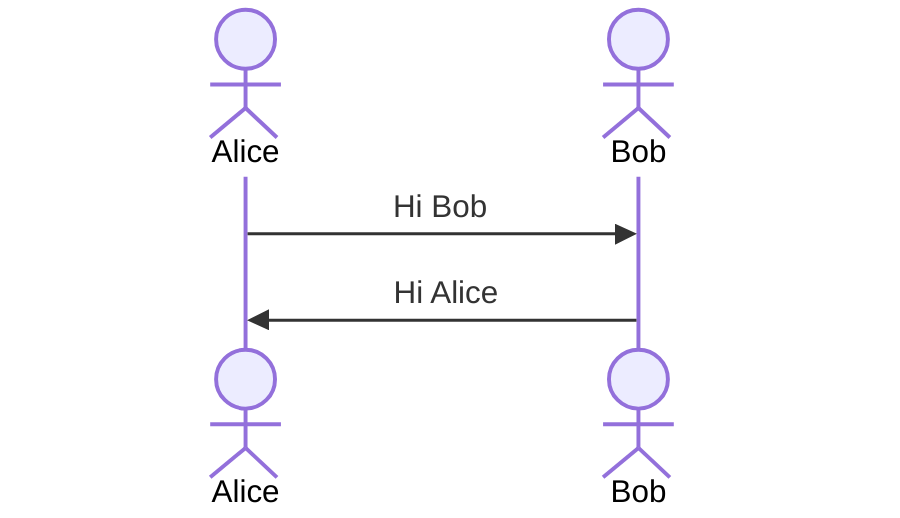

# Example presentation
#### Include your name here

<!-- This is the title slide: -->
<!-- _class: title -->
<!-- _footer: '' -->
<!-- _paginate: false -->

---

# Example slide

This slide has cool mermaid stuff

---  

# Example slide

You can scale a mermaid diagram with scale classes (check the theme css for available scales)

<!-- _class: scale-180 -->

